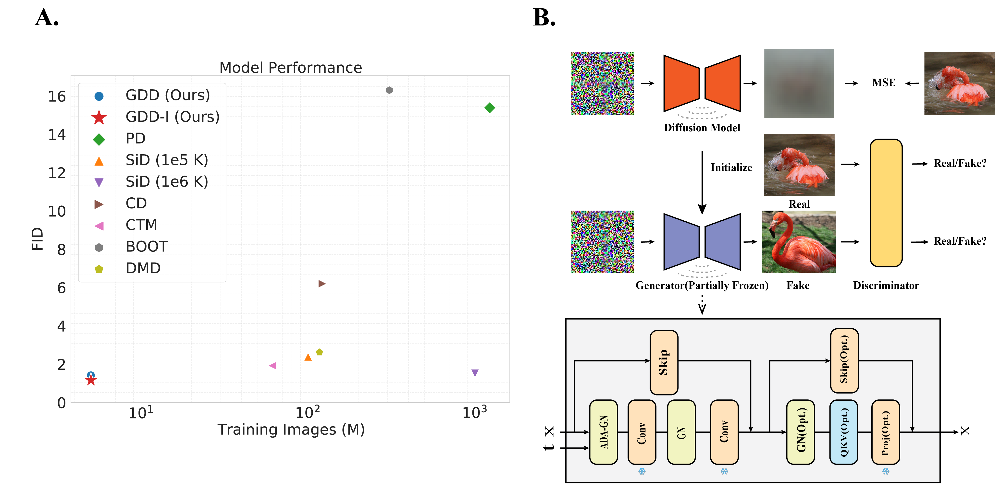

# GDD - Official Pytorch implementation

**Diffusion Models Are Innate One-Step Generators**

Bowen Zheng, Tianming Yang

[arxiv](https://arxiv.org/abs/2405.20750)

>Diffusion Models (DMs) have achieved great success in image generation and
other fields. By fine sampling through the trajectory defined by the SDE/ODE
solver based on a well-trained score model, DMs can generate remarkable high-
quality results. However, this precise sampling often requires multiple steps and is
computationally demanding. To address this problem, instance-based distillation
methods have been proposed to distill a one-step generator from a DM by having
a simpler student model mimic a more complex teacher model. Yet, our research
reveals an inherent limitations in these methods: the teacher model, with more steps
and more parameters, occupies different local minima compared to the student
model, leading to suboptimal performance when the student model attempts to
replicate the teacher. To avoid this problem, we introduce a novel distributional
distillation method, which uses an exclusive distributional loss. This method
exceeds state-of-the-art (SOTA) results while requiring significantly fewer training
images. Additionally, we show that DMs’ layers are activated differently at different
time steps, leading to an inherent capability to generate images in a single step.
Freezing most of the convolutional layers in a DM during distributional distillation
leads to further performance improvements. Our method achieves the SOTA results
on CIFAR-10 (FID 1.54), AFHQv2 64x64 (FID 1.23), FFHQ 64x64 (FID 0.85)
and ImageNet 64x64 (FID 1.16) with great efficiency. Most of those results are
obtained with only 5 million training images within 6 hours on 8 A100 GPUs. This
breakthrough not only enhances the understanding of efficient image generation
models but also offers a scalable framework for advancing the state of the art in
various applications.

Validation codes are avaliable. Training codes will be released once this work is accepted.

The references for computing FID are from [EDM](https://github.com/NVlabs/edm).

A large portion of codes in this repo is based on [EDM](https://github.com/NVlabs/edm) and [StyleGAN2-ADA](https://github.com/NVlabs/stylegan2-ada-pytorch). 

### Install enviroments
> conda create -n gdd python=3.9
>
> pip install torch==1.12.1+cu116 torchvision==0.13.1+cu116 torchaudio==0.12.1 --extra-index-url https://download.pytorch.org/whl/cu116
>
> pip install -r requirements.txt

### Download models
> Download from [Google Drive](https://drive.google.com/drive/folders/1U0lrxJWcLt5d3oAbVUU3FJOY0lQSrZQH?usp=sharing)
>
> put the model to all_ckpt. E.g., GDD/all_ckpt/cifar_uncond_gdd_i.pkl

### FID
> sh validation_fid.sh

### Inception Score & Precision/Recall
**It is strongly recommended NOT to run this on A100 since it will be extremely slow for unknown reasons.**

NOTE, there is a trade off between FID and IS during training, checkpoints are with lowest FID.

For computing precision/recall on imagenet 64x64, download ref batches from [guided-diffusion](https://openaipublic.blob.core.windows.net/diffusion/jul-2021/ref_batches/imagenet/64/VIRTUAL_imagenet64_labeled.npz) and put it into results/imagenet.

> cd evaluations

Use conda instead of pip to install TensorFlow; otherwise, the GPU driver will not be found.
> conda install tensorflow-gpu
>
> pip install -r requirements.txt

Then
> sh validate_is_pr

