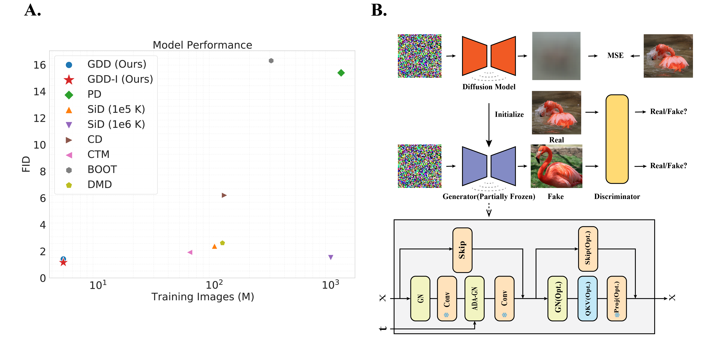

NOTE:
>**I am actively seeking a PhD or Research Assistant (RA) position in image and video generation. Additionally, I would greatly appreciate any GPU resources to support my research. You can download my [CV](https://drive.google.com/file/d/1v76e36V_af32eQywL7sKP0a4hLLy9zwL/view?usp=drive_link) and [Statement of Purpose (SOP)](https://drive.google.com/file/d/1N3oPb7LSTa1NElNFU-HvDE0YlWnye8wl/view?usp=drive_link) here. Please don’t hesitate to contact (zyriix213@gmail.com) me if you are interested in working with me.**

# GDD - Official Pytorch implementation

## Diffusion Models Are Innate One-Step Generators  [[arxiv]](https://arxiv.org/abs/2405.20750)

Bowen Zheng, Tianming Yang

*Diffusion Models (DMs) have achieved great success in image generation and
other fields. By fine sampling through the trajectory defined by the SDE/ODE
solver based on a well-trained score model, DMs can generate remarkable high-
quality results. However, this precise sampling often requires multiple steps and is
computationally demanding. To address this problem, instance-based distillation
methods have been proposed to distill a one-step generator from a DM by having
a simpler student model mimic a more complex teacher model. Yet, our research
reveals an inherent limitations in these methods: the teacher model, with more steps
and more parameters, occupies different local minima compared to the student
model, leading to suboptimal performance when the student model attempts to
replicate the teacher. To avoid this problem, we introduce a novel distributional
distillation method, which uses an exclusive distributional loss. This method
exceeds state-of-the-art (SOTA) results while requiring significantly fewer training
images. Additionally, we show that DMs’ layers are activated differently at different
time steps, leading to an inherent capability to generate images in a single step.
Freezing most of the convolutional layers in a DM during distributional distillation
leads to further performance improvements. Our method achieves the SOTA results
on CIFAR-10 (FID 1.54), AFHQv2 64x64 (FID 1.23), FFHQ 64x64 (FID 0.85)
and ImageNet 64x64 (FID 1.16) with great efficiency. Most of those results are
obtained with only 5 million training images within 6 hours on 8 A100 GPUs. This
breakthrough not only enhances the understanding of efficient image generation
models but also offers a scalable framework for advancing the state of the art in
various applications.*

## Related Repositories
The references for computing FID are from [EDM](https://github.com/NVlabs/edm), and a large portion of codes in this repo is based on [EDM](https://github.com/NVlabs/edm) and [StyleGAN2-ADA](https://github.com/NVlabs/stylegan2-ada-pytorch). 

## Prepare Environments
> conda create -n gdd python=3.9

Use conda instead of pip to install TensorFlow; otherwise, the GPU driver will not be found.
> conda install tensorflow-gpu

Manually install torch to avoid conflicts.
> pip install torch==1.12.1+cu116 torchvision==0.13.1+cu116 torchaudio==0.12.1 --extra-index-url https://download.pytorch.org/whl/cu116

For training and validation
> pip install -r requirements.txt 

If you are only interested im validation or inference.
> pip install -r requirements_validation.txt 

## Training
NOTE: To release the training code as quickly as possible, we’ve modified and removed a large portion of irrelevant or experimental code for clarity. We will continuously check the results but there might be some potential issues. If you have any problems, please open an issue, and we will reply ASAP.

### Download Diffusion Checkpoints
Follow [EDM's guaidance](https://github.com/NVlabs/edm?tab=readme-ov-file#pre-trained-models), and put the checkpoints into `GDD/pretrained`, e.g., `GDD/pretrained/edm-afhqv2-64x64-uncond-ve.pkl`.

### Prepare the datasets
Follow [EDM's guaidance](https://github.com/NVlabs/edm?tab=readme-ov-file#preparing-datasets), and put the datasets into `GDD/datasets`, e.g., `GDD/datasets/cifar10-32x32.zip`
### Running
All the training commands are available in `train.sh`. You may modify the parameters according to your needs.
> sh train.sh

## Validation

### Download Checkpoints
Download from [Google Drive](https://drive.google.com/drive/folders/1U0lrxJWcLt5d3oAbVUU3FJOY0lQSrZQH?usp=sharing), and put the model to `GDD/all_ckpt`. E.g., `GDD/all_ckpt/cifar_uncond_gdd_i.pkl`

### FID
> sh validation_fid.sh

### Inception Score & Precision/Recall
**It is strongly recommended NOT to run this on A100 since it will be extremely slow for unknown reasons.**

NOTE, there is a trade off between FID and other metrics during training, checkpoints are with lowest FID.

For computing precision/recall on imagenet 64x64, download ref batches from [guided-diffusion](https://openaipublic.blob.core.windows.net/diffusion/jul-2021/ref_batches/imagenet/64/VIRTUAL_imagenet64_labeled.npz) and put it into `results/imagenet`.

Then
> cd evaluations \
> sh validate_is_pr

## CLIP-FID Metrics
In the study "[The Role of ImageNet Classes in Fréchet Inception Distance](https://arxiv.org/abs/2203.06026)", raised concerns about potential data leakage in FID when using discriminator pretrained on ImageNet. We provide CLIP-FID below. Our method consistently shows superior or competitive performance with significantly less training data.

|Dataset|Model|CLIP-FID|FID|Training Img
|-|-|-|-|-|
|CIFAR10|EDM|**0.53**|1.98||
||CD|1.26|4.10|~100M|1|
||SiD|0.65|1.92|~400M|1|
||GDD-I|0.66|**1.56**|**~5M**|
|FFHQ|EDM|1.18|2.39||
||SiD|**0.80**|1.55|~500M|1|
||GDD-I|0.81|**0.83**|**~9M**|
|AFHQv2|EDM|0.40|1.96||
||SiD|0.32|1.62|~300M|1|
||GDD-I|**0.18**|**1.24**|**~7M**|
|ImageNet|EDM|0.82|2.64||
||CD|2.93|6.87|~1000M|1|
||SiD|0.75|1.52|~930M|1|
||GDD-I|**0.51**|**1.13**|**~6M**|

## Citation
If you find our work useful, please consider citing our work:

>@misc{zheng2024diffusionmodelsinnateonestep,
     title={Diffusion Models Are Innate One-Step Generators}, \
      author={Bowen Zheng and Tianming Yang},\
      year={2024},\
      eprint={2405.20750},\
      archivePrefix={arXiv},\
      primaryClass={cs.CV},\
      url={https://arxiv.org/abs/2405.20750}, \
}

